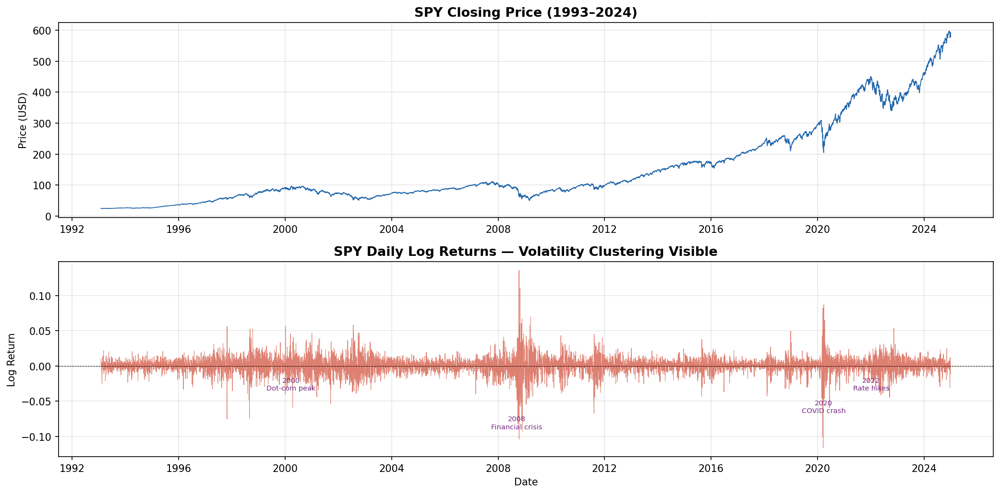
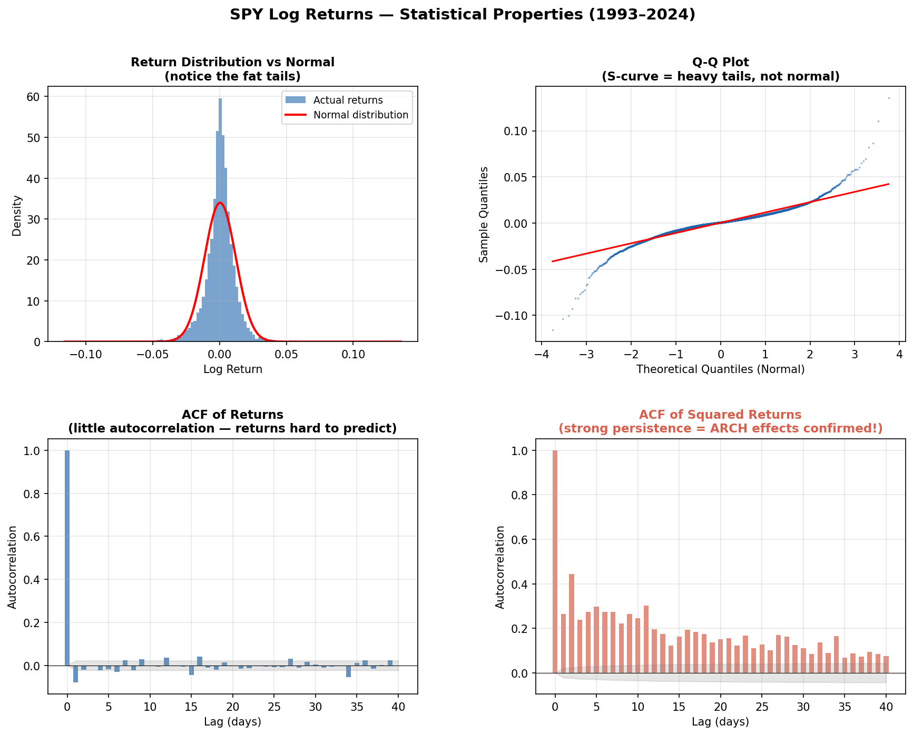
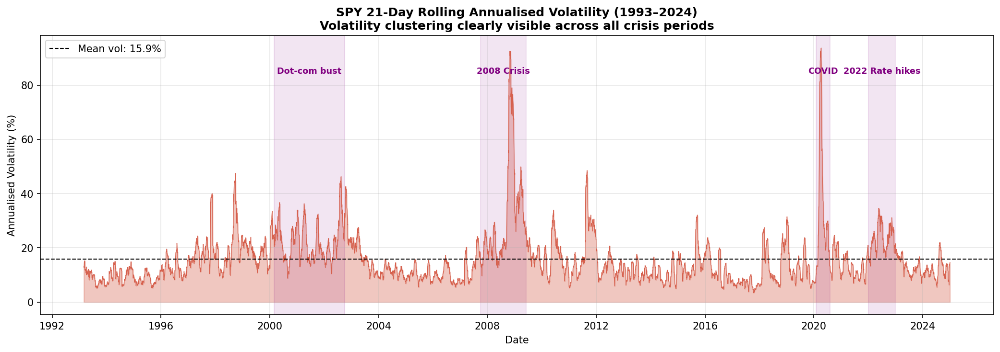
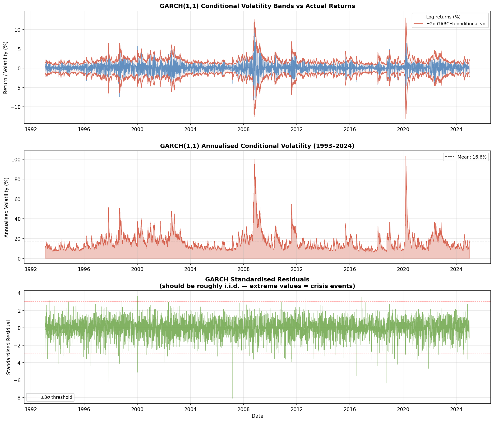
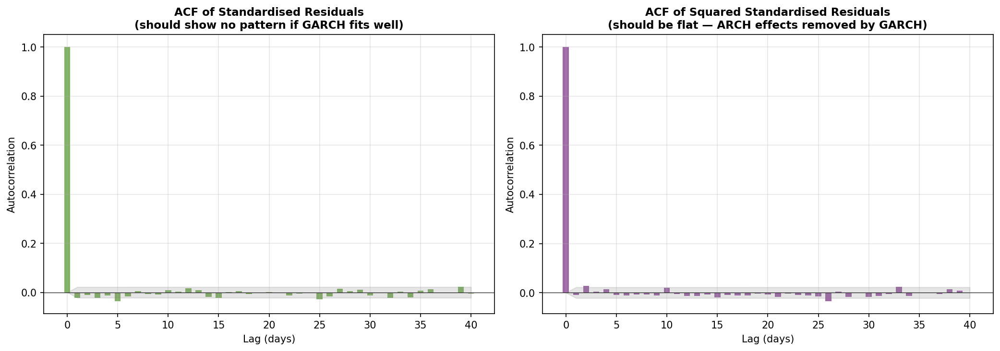
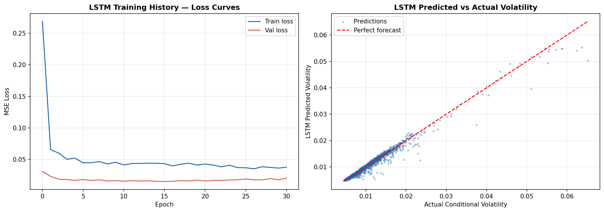
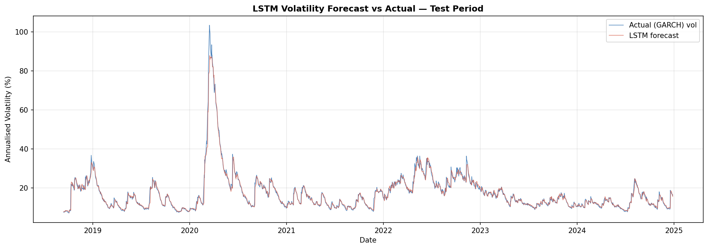
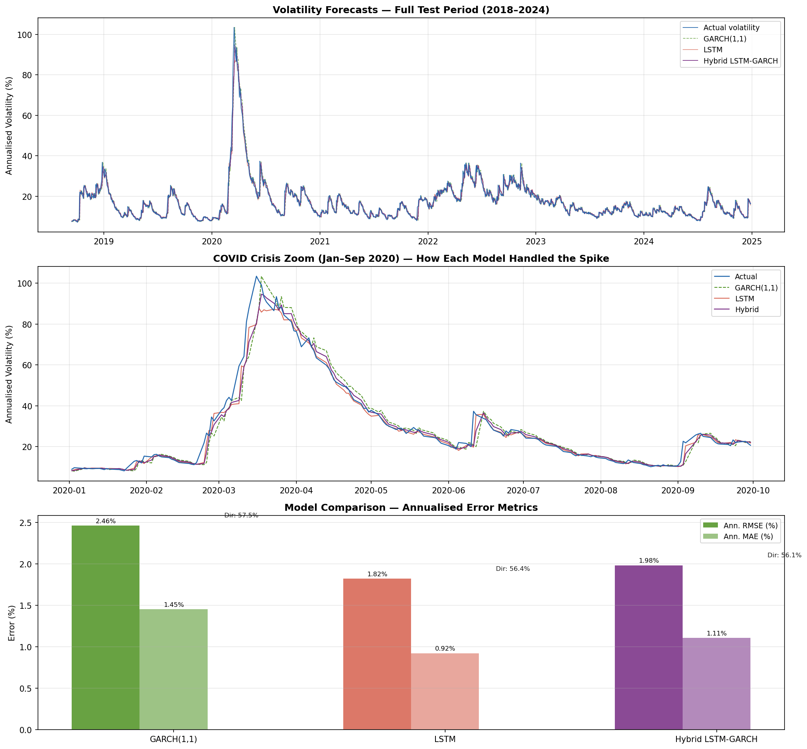
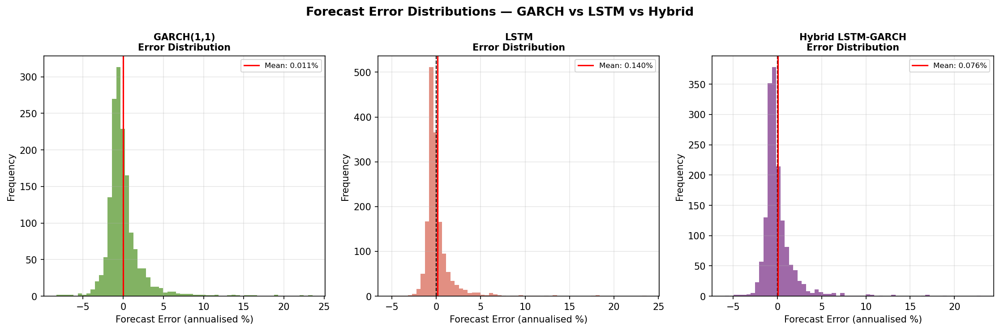

# Hybrid LSTM-GARCH Framework for S&P 500 Volatility Forecasting

A hybrid deep learning and econometric approach to forecasting S&P 500 daily volatility using 31 years of market data (1993–2024).

---

## Project Overview

This project combines GARCH(1,1) — the classical econometric model for volatility clustering — with a two-layer LSTM neural network to forecast next-day conditional volatility of SPY (S&P 500 ETF). The architecture follows a residual learning approach: GARCH captures linear volatility dynamics, and LSTM learns nonlinear patterns from the GARCH residuals and conditional variance estimates.

**Key result: LSTM reduced GARCH forecast error by 26% on RMSE across a 1,582-day out-of-sample test period covering September 2018 to December 2024.**

---

## Architecture

```
SPY daily prices (1993–2024)
         ↓
  Daily log returns
         ↓
    GARCH(1,1) with Student-t errors
    → captures volatility clustering and fat tails
         ↓
  GARCH conditional variance + standardised residuals
         ↓
    2-layer LSTM (64 → 32 units)
    → learns nonlinear regime patterns from 20-day lookback windows
         ↓
  Hybrid forecast = average of LSTM and GARCH predictions
         ↓
  Evaluation against GARCH baseline on held-out test set
```

---

## Data

| Property | Value |
|----------|-------|
| Asset | SPY (SPDR S&P 500 ETF Trust) |
| Source | Yahoo Finance via yfinance |
| Period | 1993-01-29 to 2024-12-30 |
| Observations | 8,036 trading days |
| Train period | Feb 1993 – Aug 2018 (80%) |
| Test period | Sep 2018 – Dec 2024 (20%) |

---

## Statistical Properties of SPY Log Returns

All three properties that justify the LSTM-GARCH approach were formally confirmed before modeling:

| Property | Test | Statistic | P-value | Conclusion |
|----------|------|-----------|---------|------------|
| Non-normality | Jarque-Bera | 41,107.69 | 0.000 | Fat tails confirmed — Student-t justified |
| Stationarity | Augmented Dickey-Fuller | -22.59 | 0.000 | Stationary — safe to model directly |
| Volatility clustering | Engle ARCH LM | 2,160.97 | 0.000 | ARCH effects confirmed — GARCH justified |

Additional return statistics:
- Mean daily return: 0.000395 (9.96% annualised)
- Daily standard deviation: 0.011731 (18.62% annualised volatility)
- Skewness: -0.30 (left tail slightly heavier)
- Excess kurtosis: 11.07 (extremely fat tails vs normal distribution of 0)
- Worst single day: -11.6% on March 16, 2020 (COVID crash)
- Best single day: +13.6% on October 13, 2008 (post-Lehman rebound)

---

## GARCH(1,1) Model

Fitted using maximum likelihood with Student-t errors. All parameters highly significant (p < 0.001).

| Parameter | Estimate | Interpretation |
|-----------|----------|----------------|
| ω (omega) | 0.012984 | Long-run variance baseline |
| α (alpha) | 0.1133 | Reaction to market shocks — ARCH term |
| β (beta) | 0.8833 | Volatility persistence — GARCH term |
| α + β | 0.9966 | Near unit-root — very long volatility memory |
| ν (nu) | 5.97 | Student-t degrees of freedom — heavy tails |

- **Half-life of volatility shock:** 205.8 days — shocks decay over approximately 10 months
- **Mean conditional volatility:** 16.62% annualised
- **Peak conditional volatility:** 103% annualised on March 17, 2020

The residual diagnostics confirm a good fit — both ACF of standardised residuals and ACF of squared standardised residuals are flat, confirming all volatility clustering has been removed by the GARCH model.

---

## LSTM Model

### Architecture

| Layer | Configuration | Parameters |
|-------|--------------|------------|
| LSTM (return_sequences=True) | 64 units | 18,432 |
| Dropout | rate = 0.2 | — |
| LSTM | 32 units | 12,416 |
| Dropout | rate = 0.2 | — |
| Dense (ReLU activation) | 16 units | 528 |
| Dense (linear output) | 1 unit | 17 |
| **Total** | | **31,393** |

### Input Features (7 features, 20-day lookback window)

| Feature | Description |
|---------|-------------|
| Log_Return | Daily log return |
| Cond_Vol | GARCH conditional volatility |
| Std_Residual | GARCH standardised residual |
| Sq_Return | Squared return (volatility proxy) |
| Abs_Return | Absolute return (volatility proxy) |
| RollVol_5 | 5-day rolling standard deviation |
| RollVol_21 | 21-day rolling standard deviation |

### Training Configuration

- Optimizer: Adam (learning rate = 0.001, reduced on plateau)
- Loss function: Mean Squared Error
- Early stopping: patience = 15 epochs (best epoch: 16 of 100)
- Validation split: 15% of training data
- Batch size: 32
- Random seed: 42 (fully reproducible)

---

## Results

### Overall Performance — Test Period (Sep 2018 – Dec 2024, 1,582 days)

| Model | Ann. RMSE | Ann. MAE | MAPE | Directional Accuracy |
|-------|-----------|----------|------|----------------------|
| GARCH(1,1) | 2.46% | 1.45% | 7.70% | 57.5% |
| **LSTM** | **1.82%** | **0.92%** | **4.97%** | **56.4%** |
| Hybrid LSTM-GARCH | 1.98% | 1.11% | 5.96% | 56.1% |

**LSTM outperforms GARCH by 26% on RMSE and 35% on MAE.**

### Performance by Volatility Regime

| Regime | Days | GARCH RMSE | LSTM RMSE | Improvement |
|--------|------|-----------|-----------|-------------|
| Low volatility (< 12.2% ann) | 522 | 0.000460 | 0.000320 | **30.4%** |
| Mid volatility (12.2–18.3% ann) | 538 | 0.001074 | 0.000743 | **30.8%** |
| High volatility / crisis (> 18.3% ann) | 522 | 0.002426 | 0.001822 | **24.9%** |

LSTM outperforms GARCH across all three volatility regimes. The improvement is largest during calm and moderate markets — LSTM captures nonlinear patterns that GARCH misses even when volatility is not elevated.

### COVID-19 Crisis Performance

During the most extreme volatility event in the test period (March 2020, peak of 103% annualised), all three models tracked the spike closely. The key difference is on the recovery — LSTM and the hybrid tracked the mean-reversion more precisely than GARCH, which showed a slight tendency to overestimate volatility persistence after the peak.

### Why the Hybrid Did Not Beat LSTM Alone

The simple equal-weight hybrid (average of LSTM and GARCH) sits between the two individual models on all metrics. This is consistent with the ensemble learning literature — when one component is substantially stronger, equal-weight averaging dilutes its signal rather than amplifying it. Future work could explore optimal weighting schemes or a learned combiner trained on a held-out validation set.

---

## Visualisations

### SPY Price and Log Returns (1993–2024)


---

### Return Distribution and Statistical Properties


*Top left: actual return distribution vs normal curve — fat tails clearly visible. Top right: Q-Q plot showing the S-curve signature of heavy tails. Bottom left: ACF of returns — little autocorrelation, direction hard to predict. Bottom right: ACF of squared returns — strong persistence confirming ARCH effects and justifying GARCH.*

---

### Rolling Annualised Volatility


*21-day rolling annualised volatility with major crisis periods shaded. Mean volatility of 15.9% across the full period. The 2008 financial crisis and COVID-19 crash are the two dominant volatility spikes.*

---

### GARCH(1,1) Conditional Volatility


*Top: GARCH ±2σ volatility bands around actual returns — bands widen dramatically during crises. Middle: annualised conditional volatility peaking at 103% on March 17, 2020. Bottom: standardised residuals — mostly within ±3σ with extreme values corresponding to crisis events.*

---

### GARCH Residual Diagnostics


*Both ACF plots are nearly flat — no remaining autocorrelation in standardised residuals or squared residuals. GARCH successfully removed all volatility clustering. The remaining signal is what the LSTM learns to capture.*

---

### LSTM Training History


*Left: training and validation loss converge cleanly at epoch 16 — no overfitting. Right: predicted vs actual volatility scatter — tight clustering around the perfect forecast line across the full volatility range.*

---

### LSTM Volatility Forecast vs Actual — Test Period


*LSTM forecast (red) tracks actual GARCH conditional volatility (blue) closely across the full 2018–2024 test period including the COVID spike to 103% annualised volatility in March 2020.*

---

### Three-Model Comparison


*Top: all three models over the full test period — lines nearly overlapping. Middle: COVID crisis zoom showing how each model handled the March 2020 spike — LSTM and hybrid track the recovery more precisely than GARCH. Bottom: bar chart of annualised RMSE and MAE — LSTM beats GARCH by 26% on RMSE.*

---

### Forecast Error Distributions


*All three error distributions are centered near zero — no systematic bias. LSTM (centre) has the narrowest, most concentrated distribution. GARCH (left) has slightly heavier right tails — it occasionally underestimates volatility more severely than LSTM, a critical failure mode for insurance and risk management applications.*

---

## Output Files

| File | Description |
|------|-------------|
| outputs/01_spy_price_returns.png | SPY closing price and daily log returns (1993–2024) |
| outputs/02_return_statistics.png | Return distribution, Q-Q plot, ACF analysis |
| outputs/03_rolling_volatility.png | 21-day rolling annualised volatility with crisis periods |
| outputs/04_garch_volatility.png | GARCH conditional volatility bands and standardised residuals |
| outputs/05_garch_residual_diagnostics.png | Residual ACF plots confirming GARCH fit quality |
| outputs/06_lstm_training.png | Training loss curves and predicted vs actual scatter plot |
| outputs/07_lstm_forecast.png | LSTM forecast vs actual over full test period |
| outputs/08_model_comparison.png | Three-model comparison, COVID crisis zoom, error bar chart |
| outputs/09_error_distributions.png | Forecast error distributions for all three models |
| data/garch_outputs.csv | GARCH conditional volatility and standardised residuals |
| data/lstm_predictions.csv | LSTM predictions and actuals on test set |
| data/model_comparison.csv | Final evaluation metrics for all three models |

---

## How to Reproduce

```bash
# Install dependencies
pip install yfinance arch tensorflow scikit-learn pandas numpy matplotlib seaborn statsmodels scipy

# Run scripts in order
python scripts/01_data_download.py
python scripts/02_eda.py
python scripts/03_garch_model.py
python scripts/04_lstm_model.py
python scripts/05_hybrid_evaluation.py
```

---

## Dependencies

| Package | Version |
|---------|---------|
| Python | >= 3.9 |
| yfinance | >= 0.2.0 |
| arch | >= 5.0.0 |
| tensorflow | >= 2.10.0 |
| scikit-learn | >= 1.0.0 |
| pandas | >= 1.5.0 |
| numpy | >= 1.23.0 |
| matplotlib | >= 3.5.0 |
| statsmodels | >= 0.13.0 |
| scipy | >= 1.9.0 |

---

## Author

**Princess Tagoe**
Statistical Consultant · Data Scientist · Actuarial Science 

[GitHub](https://github.com/tagoep) · [Medium](https://medium.com/@princesstagoe24)

---

## License

MIT License — see LICENSE file for details.
